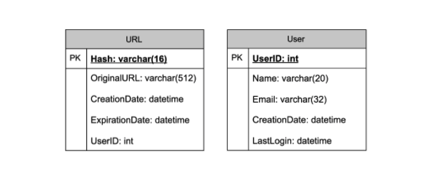

# TinyURL

## 1. Why do we need URL shortening?

- 단축 url은 실제 url의 1/3 크기로 링크를 최적화
- 개별 링크를 추적하여 잠재 고객을 분석
- 광고 캠페인의 실적을 측정
- 연결된 원래 url을 숨기는데 사용

## 2. Requirements and Goals of the System

### 기능 요구사항
1. url 이 주어지면 서비스는 더 짧고 고유한 별칭을 생성
   - 짧기에 대한 기준은 응용 프로그램에 쉽게 복사하여 붙여 넣을 수 있을 만큼
2. 단축 링크에 access하면 당사 서비스는 사용자를 원래 링크로 리다이렉션
3. 사용자는 선택적으로 url에 대한 custom 링크를 선택할 수 있어야 한다.
4. 링크는 표준 기본 기간이 지나면 만료된다. 사용자는 만료시간을 지정할 수 있어야한다.

### 비기능적 요구사항
1. 시스템은 고가용성이어야한다.
   - 서비스가 중단되면 모든 url 리다이렉션이 실패하기 때문
2. url 리다이렉션은 최소한의 지연 시간으로 실시간으로 발생해야 한다.
3. 단축링크는 추축할 수 없어야 한다.

### 확장된 요구사항
1. 분석
    - 리다이렉션이 몇 번 발생했는지 이력 확인 가능
2. 다른 서비스에서 REST API를 통해 서비스 접근 가능

## 3. Capacity Estimation and Constraints
- 현 시스템은 쓰기 보다 `읽기에 대한 작업 처리가 많을 것`이다.
- 새로운 URL의 생성에 비해 `많은 리디렉션 요청`이 있을 것이다.
- `읽기와 쓰기의 비율이 100:1` 이라고 가정

- `예상 트래픽`
   - 매월 5억개의 새로운 URL이 100:1 읽기/쓰기 비율로 발생한다고 가정하면 500억 개의 리다이렉션이 발생할 수 있다.
   > 100 * 500M => 50B
   
   - 시스템의 초당 쿼리(QPS)는 무엇입니까? 초당 단축되는 새로운 URL
   > 5 억 / (30 일 * 24 시간 * 3600 초) = ~ 200 URL / 초
   
   - 100 : 1 읽기 / 쓰기 비율을 고려할 때 초당 URL 리디렉션은 다음과 같다.
   > 100 * 200 URL / s = 20K / s

- `저장 용량 추정`
   - 모든 URL 단축 요청(및 관련 단축 링크)을 `5년 동안 저장`한다고 가정
   - 매달 5억 개의 새 URL이 있을 것으로 예상되므로 `저장할 것으로 예상되는 총 개체 수는 300억 개`가 될 것이다.
   > 5 억 * 5 년 * 12 개월 = 300 억

   - 저장된 각 객체가 약 500 바이트라고 가정할 경우, `총 15TB의 스토리지가 필요`
   > 300 억 * 500 바이트 = 15 TB

- `대역폭 추정`
   - `쓰기 요청`의 경우 초당 200 개의 새 URL이 예상되므로 서비스에 대한 총 수신 데이터는 초당 100KB
   > 200 * 500 바이트 = 100KB / s

   - 읽기 요청의 경우 초당 ~ 20,000 개의 URL 리디렉션이 예상되므로 서비스에 대한 총 발신 데이터는 초당 10MB
   > 20K * 500 바이트 = ~ 10MB / s

- `메모리 추정`
   - 자주 액세스하는 URL 중 일부를 캐시하려면 저장하는 데 얼마나 많은 메모리가 필요한가?
   - 80-20 규칙(URL의 20%가 트래픽의 80%를 생성함을 의미)을 따르는 경우 이러한 20% 핫 URL을 캐시
   - 초당 2만건의 요청이 있으므로 하루 17억건의 요청이 발생
   > 20K * 3600 초 * 24 시간 = ~ 17 억

   - 이러한 요청의 20%를 캐시하려면 170GB의 메모리가 필요
   > 0.2 * 17 억 * 500 바이트 = ~ 170GB

   - 여기서 주목해야 할 점은 동일한 URL의 중복 요청이 많기 때문에 `실제 메모리 사용량이 170GB 미만`이라는 것

- `대략적인 추정치`
   - 월 5억 개의 새 URL과 100:1의 읽기:쓰기 비율을 가정하면 다음은 Google 서비스의 대략적인 추정치
   - 정리
   
      |종류|수치|
      |:---|:---|
      |새 URL|200 / 초|
      |URL 리다이렉션|20K / s|
      |수신 데이터|100KB / s|
      |출력 데이터|10MB / s|
      |5년동안 보관 용량|15TB|
      |캐시용 메모리|170GB|

## 4. System APIs
> - 요구 사항을 완료 한 후에는 항상 시스템 API를 정의하는 것이 좋다.
> - 시스템에서 예상되는 것을 명시적으로 명시

- SOAP 또는 REST API를 사용하여 서비스 기능을 노출
- URL을 만들고 삭제하기 위한 API의 정의

> createURL(api_dev_key, original_url, custom_alias=None, user_name=None, expire_date=None)
- `매개변수`
   - `api_dev_key (문자열)` : 등록된 계정의 API 개발자 키. 이는 무엇보다도 할당된 할당량에 따라 사용자를 제한하는 데 사용된다.
   - `original_url (문자열)` : 축약할 원래 URL입니다.
   - `custom_alias (문자열)` : URL에 대한 선택적 사용자 정의 키.
   - `user_name (문자열)` : 인코딩에 사용할 선택적 사용자 이름.
   - `expire_date (문자열)` : 단축 URL에 대한 선택적 만료 날짜.

- `반환 값`
   - 성공적으로 삽입하면 단축 된 URL이 반환됩니다. 그렇지 않으면 오류 코드를 반환합니다.

> deleteURL(api_dev_key, url_key)
- 여기서 `url_key`는 검색 할 단축 URL을 나타내는 문자열
- 성공적으로 삭제하면 `URL 제거됨`이 반환

> 주의사항
- `남용을 방지`하기 위해 `api_dev_key를 통해 사용자를 제한` 할 수 있다.
- 각 api_dev_key는 일정 기간(개발자 키마다 다른 기간으로 설정 될 수 있음)당 `URL 생성 및 리디렉션의 특정 수로 제한` 될 수 있다.

## 5. Database Design
> DB 스키마를 정의하면 다양한 구성 요소 간의 데이터 흐름을 이해하는데 도움이 되고 나중에 데이터 파티셔닝으로 확장될 수 있다.
- 저장할 데이터의 특성
   1. 수십억 개의 기록을 저장해야 한다.
   2. 저장하는 각 개체는 작다. (1K 미만)
   3. 어떤 사용자가 URL을 생성했는지 저장하는 것 외에는 레코드간에 관계가 없다.
   4. 서비스는 읽기가 많다.

> 데이터베이스 스키마
- 두 개의 테이블이 필요
   - 하나는 URL 매핑에 대한 정보를 저장하기 위한 것
   - 다른 하나는 짧은 링크를 생성한 사용자 데이터를 위한 것



- 어떤 종류의 데이터베이스를 사용해야할까?
   - 수십억 개의 행을 저장할 것으로 예상하고 객체 간의 관계를 사용할 필요가 없다.
   - `DynamoDB`, `Cassandra` 또는 Riak 과 같은 NoSQL 저장소 가 더 나은 선택
   - [NoSQL](../docs/basics/09.SQL_NoSQL.md)을 선택하면 확장하기가 더 쉽다.

## 6. Basic System Design and Algorithm
- 여기서 해결하는 문제는 주어진 URL에 대해 짧고 고유 한 키를 생성하는 방법이다.
   - TinyURL 예에서 단축 URL은 [http://tinyurl.com/jlg8zpc](http://tinyurl.com/jlg8zpc)
   - URL의 마지막 7자는 생성하려는 `단축키`이다.

> Encoding actual URL
1. 주어진 URL 의 고유 한 해시 (예 : MD5 또는 SHA256 등)를 계산할 수 있다.
2. 그다음 해시를 인코딩하여 표시한다.
   - 이 인코딩은 base36([az, 0-9]) 또는 base62([AZ, az, 0-9]) 일 수 있으며 '+'와 '/'를 추가하면 Base64 인코딩을 사용할 수 있다.
   - 단축 키의 길이가 어떻게 되어야 하는가?

- base64 인코딩을 사용하면 6 자 길이의 키가 64 ^ 6 = ~ 68.7 억 개의 가능한 문자열
- base64 인코딩을 사용하면 8 자 길이의 키는 64 ^ 8 = ~ 281 조 개의 가능한 문자열

- 68.7B 고유 문자열을 사용하여 6 개의 문자 키가 시스템에 충분하다고 가정

- `MD5 알고리즘을 해시 함수로 사용`하면 `128 비트 해시 값`이 생성
- base64 인코딩 후에는 `21자 이상의 문자열`을 얻게됨 
  (각 base64 문자는 해시 값의 `6비트를 인코딩`하기 때문에)

- 키를 `8자`만 사용하는 경우, 키가 중복 될 수 있다.
- 위 문제를 해결하기 위해 `인코딩 문자열에서 다른 문자를 선택`하거나 `일부 문자를 바꿀` 수 있다.

- 인코딩 체계에 다음과 같은 `몇 가지 문제`
   1. 여러 사용자가 동일한 URL을 입력하면 허용되지 않는 동일한 단축 URL을 얻을 수 있다.
   2. URL의 일부가 URL 인코딩 된 경우, URL 인코딩을 제외하고는 동일
   ```text
   ?id=design
   %3Fid%3Ddesign
   ```
- `문제에 대한 해결 방법`
1. 각 입력 URL에 증가하는 시퀀스 번호를 추가하여 고유하게 만든다음 해시를 생성
   - 하지만이 시퀀스 번호를 데이터베이스에 저장할 필요는 없다.
   - 이 접근 방식의 가능한 문제는 계속 증가하는 시퀀스 번호 일 수 있다.
   - 증가하는 시퀀스 번호를 추가하면 서비스 성능에도 영향을 미친다.

2. 사용자 ID(고유해야 함)를 입력 URL에 추가
   - 그러나 사용자가 로그인하지 않은 경우 `사용자에게 고유성 키를 선택`하도록 요청
   - 이 후에도 충돌이 발생하면 `고유 한 키를 얻을 때까지 키를 계속 생성`해야 한다.


> Generating keys offline

## 7. Data Partitioning and Replication

## 8. Cache

## 9. Load Balancer (LB)

## 10. Purging or DB cleanup

## 11. Telemetry

## 12. Security and Permissions


## 참고
- [DynamoDB](https://en.wikipedia.org/wiki/Amazon_DynamoDB)
- [Cassandra](https://en.wikipedia.org/wiki/Apache_Cassandra)
- [Riak](https://en.wikipedia.org/wiki/Riak)
- [MD5](https://en.wikipedia.org/wiki/MD5)
- [SHA256](https://en.wikipedia.org/wiki/SHA-2)
- [Base64](https://en.wikipedia.org/wiki/Base64#Base64_table)
