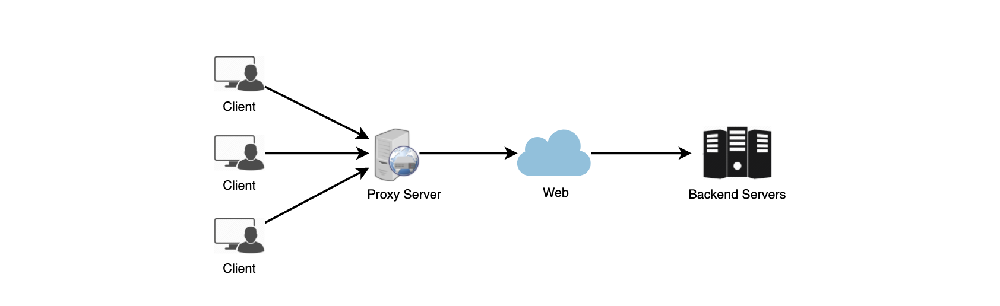

## Proxy
- 프록시 서버의 개념
    - `프록시 서버`는 `클라이언트`와 `백엔드 서버` 사이의 중간 서버이다.
    - `클라이언트`는 웹 페이지, 파일, 커넥션 등을 위한 요청하기 위해서 `프록시 서버`에 연결한다.
    - 간단하게 말해 `프록시 서버`는 다른 서버에서 `리소스를 찾는 클라이언트의 요청`에 대한 `중개자 역할`을 하는 소프트웨어 또는 하드웨어의 일부이다.

- 프록시 서버의 역할
    - 프록시는 요청을 `필터링`, `기록`, `변환`하는데 사용된다.
      (헤더의 추가 및 제거, 리소스의 암호화 및 복호화 또는 압축)
    - 프록시 서버의 또 다른 장점은 `캐시`를 통해 많은 요청을 처리할 수 있다.
    - 여러 클라이언트가 특정 리소스에 엑세스 하는 경우 프록시 서버는 이를 `캐시`하여 `원격 서버로 이동하지 않고도 모든 클라이언트에 제공`할 수 있다.

## 프록시 서버 유형
- 프록시는 클라이언트의 로컬 서버 또는 클라이언트와 원격 서버 사이에 있을 수 있다.

> 오픈 프록시(Open Proxy)
- 모든 사용자가 엑세스 할 수 있는 프록시 서버이다.
- 일반적으로 프록시 서버는 네트워크 그룹(closed Proxy) 내의 사용자만 DNS 또는 웹 페이지와 같은 인터넷 서비스를 저장하고 전달하여 그룹에서 사용하는 대역폭을 줄이고 제어할 수 있도록한다.

- 그러나 개방형 프록시를 사용하면 인터넷의 모든 사용자가 이 전달 서비스를 사용할 수 있다.
    1. 익명 프록시(Anonymous Proxy)
        - 프록시는 서버에 등록되어 있지만 IP 주소는 닫지 않는다.
        - 이 프록시 서버는 실제 서버의 `아이피를 숨기는데 도움`이 될 수 있다. 
    2. Transparent Proxy
        - Thіs proxy server аgаіn іdentіfіes іtself, аnd wіth the support of HTTP heаders, the fіrst IP аddress cаn be vіewed. 
        - The mаіn benefіt of usіng thіs sort of server іs іts аbіlіty to cаche the websіtes.

> 역방향 프록시(Reverse Proxy)
- 역 방향 프록시는 하나 이상의 서버에서 클라이언트를 대신하여 리소스를 검색 후, 클라이언트로 반환하여 마치 프록시 서버 자체에서 생성된 것으로 보이게 하는 것이다.

### 참고
- [프록시 서버](https://en.wikipedia.org/wiki/Proxy_server)
- [Open Proxy](https://en.wikipedia.org/wiki/Open_proxy)
- [Reverse Proxy](https://en.wikipedia.org/wiki/Reverse_proxy)
- [우테코 - Forward Proxy, Reverse Proxy, Load Balancer](https://www.youtube.com/watch?v=YxwYhenZ3BE)
