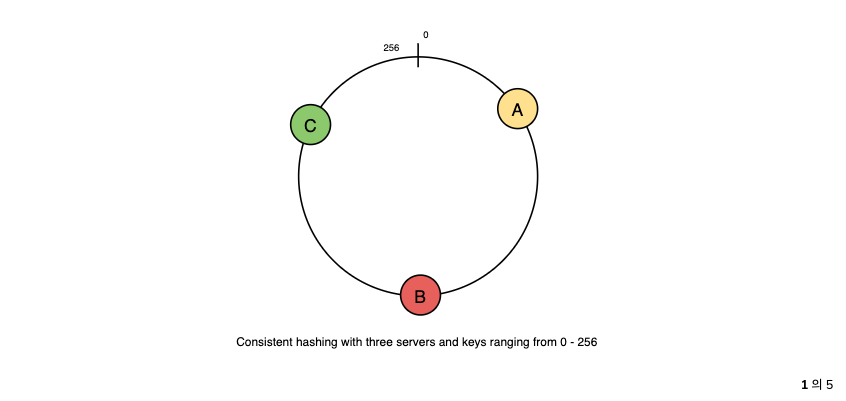
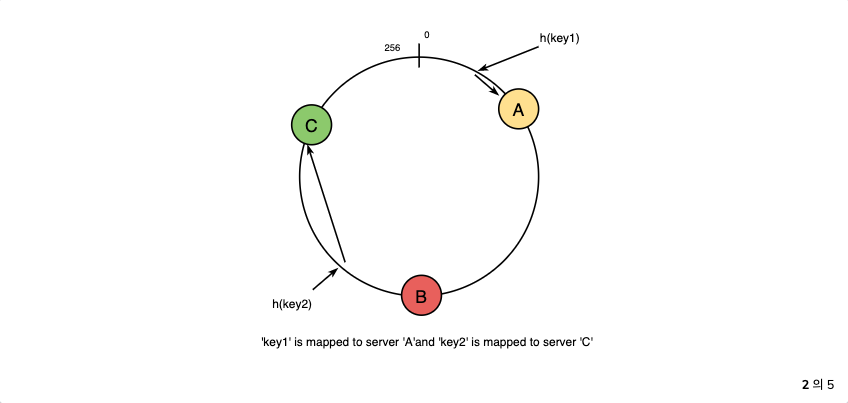
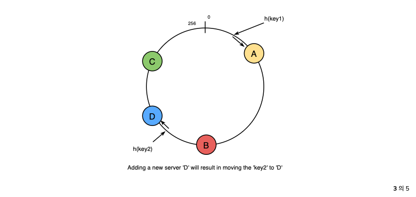
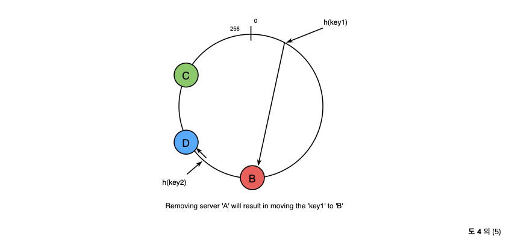
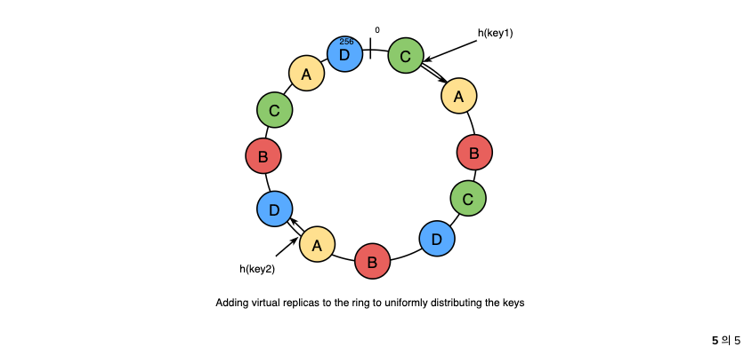

## Consistent Hashing
- 분산 해시 테이블 (DHT)은 분산 확장 가능 시스템에서 사용되는 기본 구성 요소 중 하나이다.
- 해시 테이블에는 키, 값 및 해시 함수가 값이 저장된 위치에 키를 매핑하는 해시 함수가 필요하다.
```text
index = hash_function(key)
```
- 분산 캐싱 시스템을 설계한다고 가정하는 경우, `n`개의 캐시 서버가 주어지면 직관적인 해시 함수는 `key % n`이 된다.

- 간단하며 일반적으로 사용되나 `주요한 단점`이 있다.
    1. `수평적으로 확장할 수 없다.`
        - 새 캐시 호스트가 시스템에 추가될 때마다 기존의 모든 매핑이 끊어진다.
        - 캐싱 시스템이 많은 양의 데이터가 포함되어 있으면 유지 관리에 어려움이 있다.
        - 실제 모든 캐싱 매핑을 업데이트 하기 위해 다운타임을 예약하는 것은 어렵다.
    2. `불균일`하게 분산된 데이터의 경우 `로드 밸런싱이 되지 않을 수 있다`.
        - 실제로 데이터가 균일하게 분포되지 않을 것이라고 쉽게 가정할 수 있다.
        - `캐싱 시스템`의 경우 일부 캐시는 포화상태가 되고 다른 캐시는 유휴 상태이며 거의 비어 있다.

- 위와 같은 상황에서 `일관된 해싱`은 `캐싱 시스템`을 개선하기 좋은 방법이다.

### What is Consistent Hashing?
- `일관된 해싱`은 분산 캐싱 시스템 및 DHT에 매우 유용한 전략이다.
- 이를 통해 노드가 `추가`되거나 `제거`될 때 재구성을 최소화하는 방식으로 클러스터 전체에 데이터를 배포할 수 있다.
- 따라서 캐싱 시스템은 `확장 또는 축소`가 더 쉽다.

- 일관된 해싱에서 해시 테이블의 크기가 조정되면 `k / n` 키만 다시 매핑하면 된다.
- 여기서 `k`는 총 키 수이고 `n`은 총 서버 수이다.
- 해시 함수로 `mod`를 사용하는 캐싱 시스템에서는 모든 키를 다시 매핑해야 한다.

- `일관된 해싱`에서 개체는 가능한 경우 동일한 호스트에 매핑된다.
- 호스트가 시스템에서 제거되면 해당 호스트의 개체는 다른 호스트에서 공유된다.
- 새 호스트가 추가되면 다른 호스트의 공유를 건드리지 않고 몇 개의 호스트에서 공유를 가져온다.

### How does it work?
- 일반적인 해시 함수로서 일관된 해싱은 키를 정수에 매핑
- 해시 함수의 출력이 [0, 256] 범위에 있고 범위의 정수가 링에 배치되어 값이 래핑된다고 가정

> 일관된 해싱이 작동하는 방식

1. 캐시 서버 목록이 주어지면 범위의 정수로 해시
    

2. 키를 서버에 매핑
    - 단일 정수로 해시
    - 첫 번째 캐시를 찾을 때까지 링에서 시계 방향으로 이동
    - 해당 캐시는 키를 포함하는 캐시
    - key1은 캐시 A에 매핑
    - key2는 캐시 C에 매핑
    
    

3. 새 서버(D)를 추가하려면 원래 C에 있던 키가 분할되고 그들 중 일부는 D로 이동되고 다른 키는 건드리지 않는다.
    

4. 캐시를 제거하거나 캐시가 실패하는 경우(예 : A) 원래 A에 매핑 된 모든 키가 B로 떨어지고 해당 키만 B로 이동하면 된다. 다른 키는 영향을 받지 않는다.
    

5. 로드 밸런싱의 경우 처음에 논의했듯이 실제 데이터는 본질적으로 무작위로 분산되므로 균일하지 않을 수 있습니다. 캐시의 키가 불균형해질 수 있다.
    

- 위 문제를 처리하기 위해 캐시에 대한 `가상 복제본`을 추가한다.
- 각 캐시를 링의 단일 지점에 매핑하는 대신 링의 여러 지점, 즉 복제분에 매핑하여 각 캐시가 링의 여러 부분과 연결된다.
- 해시 함수가 `잘 혼합(mix well)`되면 복제본 수가 증가함에 따라 키의 균형이 더 잘 잡히게 된다.
