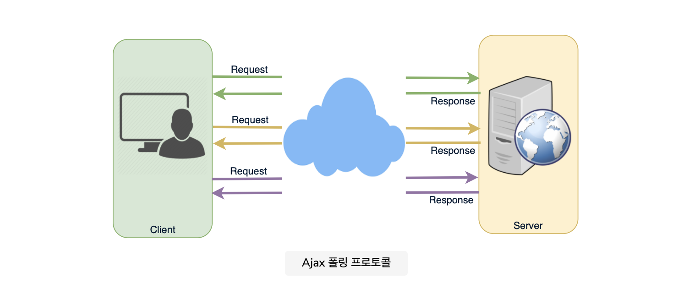
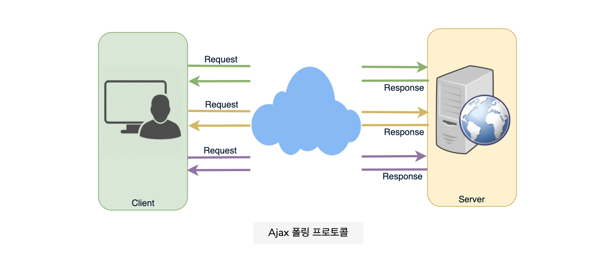
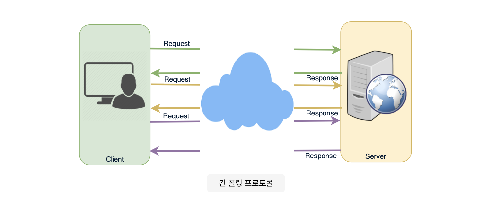
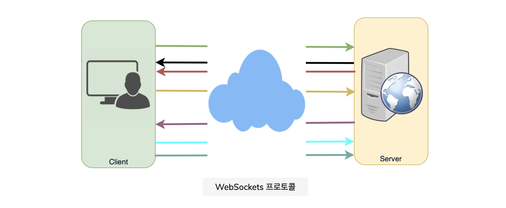
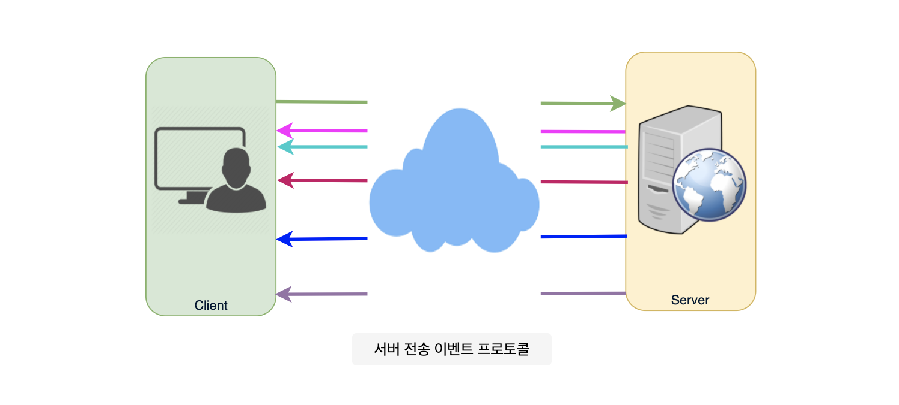

## Long-Polling vs WebSockets vs Server-Sent_Events
- `Long-Polling`, `WebSockets` 및 `Server-Sent Events`는 웹 브라우저와 같은 클라이언트와 웹 서버간에 널리 사용되는 `통신 프로토콜`이다.
- 먼저 `표준 HTTP 웹 요청이 어떻게 생겼는지 이해`하는 것으로 시작한다.
- 일반 `HTTP 요청에 대한 일련의 이벤트`이다.
    1. 클라이언트는 연결을 열고 서버에서 데이터를 요청한다.
    2. 서버는 응답을 계산한다.
    3. 서버는 열린 요청에 대해 클라이언트에 응답을 다시 보낸다.

### Ajax Polling
- 폴링은 대부분의 AJAX 애플리케이션에서 사용하는 표준 기술이다. 
- 기본 아이디어는 클라이언트가 데이터를 위해 서버를 반복적으로 폴링(또는 요청)한다는 것이다. 
- 클라이언트는 요청을 하고 서버가 데이터로 응답할 때까지 기다린다. 
- 사용 가능한 데이터가 없으면 빈 응답이 반환된다.
- 요청 프로세스
    1. 클라이언트는 연결을 열고 일반 `HTTP`를 사용하여 서버에서 데이터를 요청한다.
    2. 요청 된 웹 페이지는 `정기적인 간격 (예 : 0.5 초)으로 서버에 요청`을 보낸다.
    3. `서버`는 일반 HTTP 트래픽과 마찬가지로 응답을 계산하고 다시 보낸다.
    4. 클라이언트는 서버에서 업데이트를 받기 위해 위의 `세 단계를 주기적으로 반복`한다.

### HTTP Long-Polling
- 이는 데이터를 사용할 수 있을 때마다 서버가 클라이언트에 정보를 푸시 할 수 있도록 하는 `기존 폴링 기술의 변형`이다.
- Long-Polling을 사용하면 클라이언트는 정상적인 폴링에서와 똑같이 서버에서 정보를 요청하지만 `서버가 즉시 응답하지 않을 수도 있다`.
- 그렇기 때문에 이 기술을 `Hanging GET` 이라고도 한다.

- `서버`에 클라이언트에 사용할 수 있는 `데이터가 없는 경우`, 빈 응답을 보내는 대신 `서버는 요청을 보류`하고 `일부 데이터를 사용할 수 있을 때까지 기다린다`.
- 데이터를 사용할 수 있게되면 전체 응답이 클라이언트로 전송됩니다. 
- 그런 다음 클라이언트는 `즉시 서버에서 정보를 다시 요청`하므로 서버는 항상 이벤트에 대한 응답으로 데이터를 전달하는 데 사용할 수 있는 `사용 가능한 대기 요청`을 갖게됩니다.

- `HTTP Long-Polling`을 사용하는 애플리케이션의 기본 수명주기
    1. `클라이언트`는 일반 HTTP를 사용하여 `초기 요청`을 한 다음 응답을 기다린다.
    2. `서버`는 업데이트를 사용할 수 있거나 `시간 초과가 발생할 때까지 응답을 지연`한다.
    3. 업데이트를 사용할 수 있는 경우 `서버`는 `클라이언트에 전체 응답`을 보낸다.
    4. `클라이언트`는 일반적으로 응답을 수신하는 `즉시 또는 허용 가능한 대기 시간을 허용`하기 위해 일시중지 후에 `새로운 긴 폴링 요청`을 보낸다.
    5. 각 Long-Poll 요청에는 시간 제한이 있으며, 클라이언트는 `시간 초과로 인해 연결이 닫힌 후 주기적으로 다시 연결`해야 한다.

### WebSockets
- `WebSocket`은 `Duplex`을 제공합니다.  
- 단일 TCP 연결을 통한 통신 채널, 클라이언트와 서버간에 영구적인 연결을 제공하여 양 당사자가 언제든지 데이터 전송을 시작할 수 있다.
- 클라이언트는 WebSocket `핸드 셰이크`라는 프로세스를 통해 WebSocket 연결을 설정한다.
- 프로세스가 성공하면 서버와 클라이언트는 언제든지 `양방향으로 데이터를 교환` 할 수 있다.
- WebSocket 프로토콜은 `낮은 오버 헤드`로 `클라이언트와 서버 간의 통신을 가능`하게 하여 서버와의 `실시간 데이터 전송을 용이`하게 한다.
- 이는 서버가 클라이언트의 요청없이 브라우저에 콘텐츠를 보낼 수 있는 표준화 된 방법을 제공하고 `연결을 유지`하면서 메시지를 앞뒤로 전달할 수 있도록 함으로써 가능하다.

### Server-Sent Events (SSEs)
- `SSE`에서 클라이언트는 서버와 지속적이고 `장기적인 연결을 설정`합니다. 
- 서버는 이 연결을 사용하여 데이터를 클라이언트에 보냅니다. 
- 클라이언트가 데이터를 서버로 보내려면 다른 기술 / 프로토콜을 사용해야합니다.

1. 클라이언트는 일반 HTTP를 사용하여 서버에서 데이터를 요청한다.
2. 요청된 웹 페이지는 서버에 대한 연결을 연다.
3. 서버는 새로운 정보가 있을 때마다 클라이언트에 데이터를 보낸다.

- SSE는 서버에서 클라이언트로의 실시간 트래픽이 필요하거나 서버가 루프에서 데이터를 생성하고 여러 이벤트를 클라이언트로 보낼 때 가장 좋다.

### 참고
- [Full Duplex](https://en.wikipedia.org/wiki/Duplex_(telecommunications)#Full_duplex)

