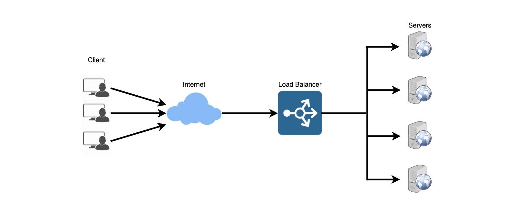
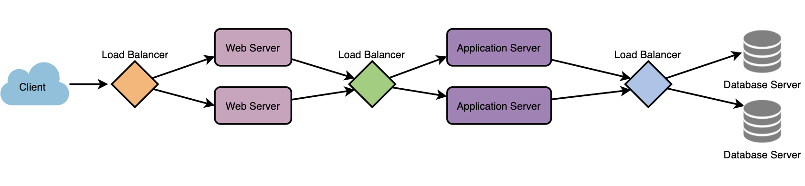
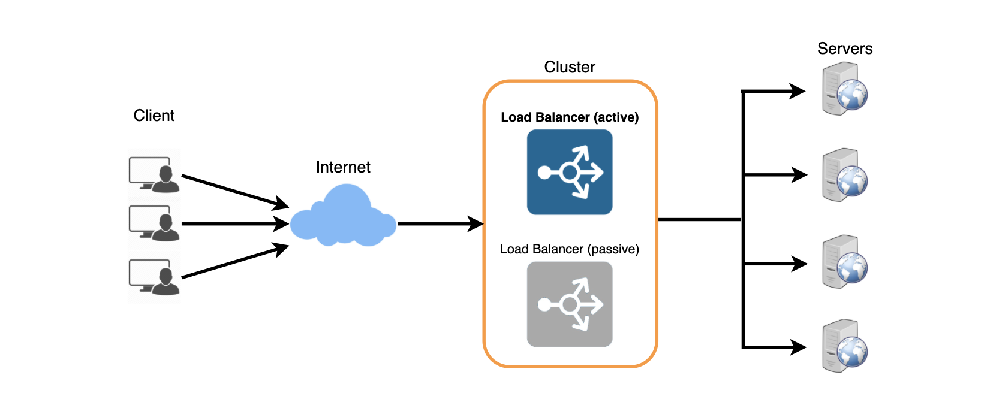

## Load Balancing
- 로드 밸런서(Load Balancer)
    - 분산 시스템의 또 다른 중요한 구성요소
    - 어플리케이션, 웹 사이트 또는 데이터베이스의 응답성, 가용성을 향상시키기 위해 서버 클러스터에 트래픽을 분산하는데 도움을 준다.
    - LB는 요청을 배포하는 동안 모든 리소스의 상태를 추적한다.
    - 서버가 요청을 받을 수 없거나 응답하지 않거나 오류율이 높은 경우 LB는 해당 서버로의 트래픽 전송을 중지한다.

- 로드 밸런서의 위치와 역할
    - 일반적으로 클라이언트와 서버 사이에 위치한다.
        - 서버란 네트워크 및 애플리케이션 트래픽을 수신하고 다양한 알고리즘을 사용하여 여러 백엔드 서버에 트래픽을 분산하는 역할을 한다.
    - 여러 서버에서 애플리케이션 요청의 균형을 잡는 LB는 개별적인 서버의 부하를 줄이고, 애플리케이션 서버가 단일 장애지점이 되는 것을 방지한다.
    - 전반적인 애플리케이션 가용성과 응답성을 향상시킨다.

- 각 Layer 간의 확장성과 중복성을 활용하기 위한 위치
    - Client 와 Web Server 사이
    - web servers와 내부 플랫폼 사이 (어플리케이션 서버 또는 캐시 서버)
    - 내부 플랫폼과 Database 사이

### Benefits of Load Balancing
- 사용자는 더 빠르고 중단 없는 서비스를 경험할 수 있다.
- 사용자는 단일 서버가 이전 작업을 완료할 때까지 기다릴 필요가 없다.
- 대신 요청이 즉시 사용가능한 리소스(서버)로 전달된다.

- 서비스를 제공하는 서버는 다운타임(downtime)이 줄어들고 처리량이 증가(higher throughput)한다.
- 로드 밸런서가 단순히 정상적인 서버(healthy server)로 라우팅하기 때문에 전체 서버 오류도 최종 사용자 경험(the end user experience)에 영향을 미치지 않는다.

- 로드 밸런싱을 사용하면 시스템 관리자가 사용자의 대기 시간을 줄이면서 들어오는 요청을 보다 쉽게 처리할 수 있다.
- 스마트 로드밸런서는 트래픽 병목 현상이 발생하기 전에 확인하는 예측 분석과 같은 이점을 제공한다.
- 결과적으로 로드밸런서는 조직에 실행 가능한 통찰력을 제공한다.
- 이는 자동화의 핵심이며 비즈니스 의사 결정에 도움이 될 수 있다.

- 시스템 관리자는 실패하거나 스트레스를받는 구성 요소를 적게 경험할 수 있다.
- 단일 장치가 많은 작업을 수행하는 대신 여러 장치가 약간의 작업을 수행하게 된다.

### Load Balancing Algorithms
> How does the load balancer choose the backend server?
- 로드밸런서는 신규 요청을 백엔드 서버로 전달하기 전에 두 가지 요소를 고려한다.
- 첫 번째로 먼저 선택한 서버가 실제로 요청에 적절하게 응답하는지 확인
- 두 번째는 정상서버 집합에서 하나를 선택하기 위한 사전에 구성된 알고리즘을 확인 

> Health Checks
- 로드밸런서는 정상적인 백엔드 서버로만 트래픽을 전달해야 한다.
- 백엔드 서버의 상태를 모니터링하기 위해 서버가 수신 대기 하는지 확인하기 위해 정기적으로 백엔드 서버에 연결을 시도한다.
- 서버가 상태 확인에 실패하면 풀에서 자동으로 제거되고 상태 확인에 다시 응답할 때까지 트래픽이 전달되지 않습니다.

> A variety of load balancing methods
- 최소 연결 방법
    - 활성 연결이 가장 적은 서버로 트래픽을 보내는 방법
    - 이 접근 방식은 서버 간에 고르지 않게 분산된 영구(persistent: 끊임없이 지속되는) 클라이언트 연결이 많은 경우 매우 유용하다.

- 최소 응답 시간 방법
    - 활성 연결이 가장 적고 평균 응답 시간이 가장 낮은 서버로 트래픽을 보내는 방법

- 최소 대역폭 방법
    - 초당 메가 비트 (Mbps)로 측정된 최소 트래픽 양을 제공하는 서버를 선택하는 방법
    
- 라운드 로빈 방법
    - 서버 목록을 순환하고 각각의 새 요청을 다음 서버로 보내는 방법
    - 목록의 끝에 도달하면 처음부터 다시 시작된다. 서버 사양이 같고 지속적인 연결이 많지 않은 경우 가장 유용하다.
    
- 가중 라운드 로빈 방법
    - 가중 라운드 로빈 스케줄링은 처리 용량이 다른 서버를 잘 처리하도록 설계 되었다.
    - 각 서버에는 가중치(처리 용량을 나타내는 정수 값)가 지정된다.
    - `가중치가 높은 서버`는 `가중치가 낮은 서버`보다 많은 연결을 얻기 전에 새 연결을 수신한다.

- IP 해시
    - 클라이언트 IP 주소의 해시를 계산하여 요청을 서버로 리다이렉션 하는 방법

### Redundant Load Balancers
- 로드밸런서는 단일 실패 지점이 될 수 있다.
- 이를 극복하기 위해 두 번째 부하 분산 장치를 첫 번째 부하 분산 장치에 연결하여 클러스터를 형성할 수 있다.
- 각 LB는 서로 LB의 상태를 모니터링하고 두 LB 모두 트래픽 및 장애 감지를 똑같이 제공할 수 있으므로 
  기본 로드 밸런서가 실패하는 경우 두 번째 로드 밸런서에게 인계한다.

### 참고
- [로드 밸런싱이란?](https://avinetworks.com/what-is-load-balancing/)
- [시스템 설계 소개](https://lethain.com/introduction-to-architecting-systems-for-scale/)
- [로드 밸런싱](https://en.wikipedia.org/wiki/Load_balancing_(computing))
