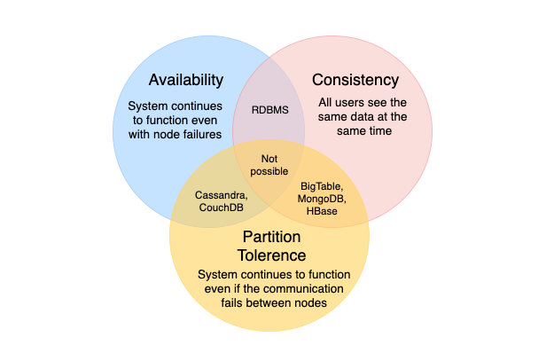

## CAP Theorem
- CAP 정리
    - `분산 소프트웨어 시스템`은 `일관성(Consistency)`, `가용성(Availability)` 및 `파티션 허용(Partition tolerance)` 오차 중 3개 중 2개 이상을 동시에 제공할 수 없다.
    - 분산 시스템을 설계 할 때 `CAP 간의 트레이딩 오프`는 거의 고려할 첫 번째 사항이다.

- CAP 정리에 따르면 분산 시스템을 설계하는 동안 다음 `세 가지 옵션 중 두 가지만 선택`할 수 있다.

### Consistency
- `모든 노드`가 동시에 동일한 데이터를 바라본다.
- 추가 읽기를 허용하여 전에 여러 노드를 업데이트하여 일관성을 유지한다.

### Availability
- `모든 요청`은 성공 및 실패에 대한 응답을 받는다.
- 가용성은 다른 서버에 데이터를 복제함으로써 달성된다.

### Partition tolerance
- 시스템은 메시지 손실 또는 부분적 오류에도 불구하고 `계속 작동`한다.
- `파티션 허용` 시스템은 전체 네트워크에 장애가 발생하지 않는 모든 네트워크 장애를 견딜 수 있다.
- 데이터는 `노드`와 `네트워크`의 조합에 걸쳐 충분히 복제되어 간헐적인 중단을 통해 시스템을 유지한다.

- 정리
    - `지속적으로 사용 가능`하고, `순차적으로 일관`되며, `파티션 오류를 허용`하는 일반 데이터 저장소를 구축할 수 없다.
    - 세 가지 속성 중 두 가지만을 포함하는 시스템을 구축해야 한다.
    - `일관성을 유지`하기 위해서는 모든 노드가 동일한 순서로 동일한 업데이트 세트를 볼 수 있어야 한다.
    - 하지만 네트워크에서 `파티션이 손실`되면 클라이언트가 최신 파티션에서 읽은 후,
      오래된 파티션에서 읽기 전에, 한 파티션의 업데이트가 다른 파티션에 적용되지 않을 수 있다.
    - 이러한 가능성에 대처하기 위해 수행할 수 있는 유일한 방법은 `오래된 파티션의 요청 처리를 중지`하는 것이다.
    - 그런 서비스는 더이상 100% 사용할 수 없다.
